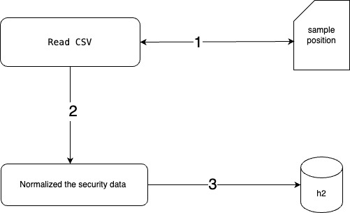
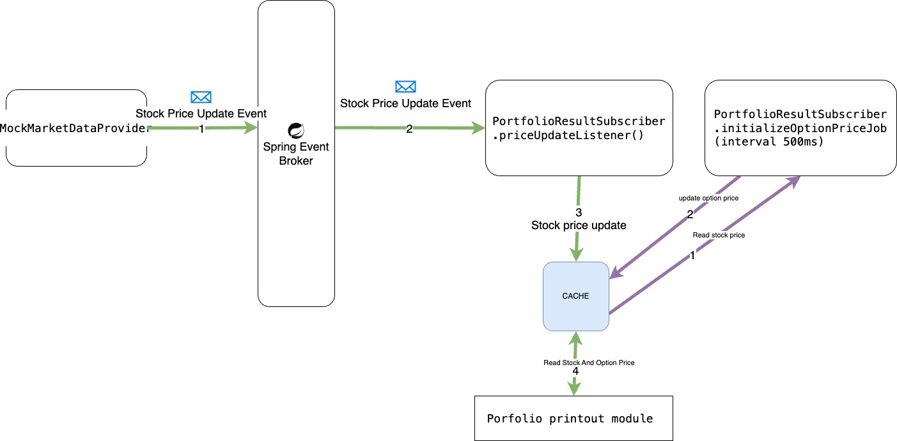

# Getting Started

### Preqrequisites
- Java 17 sdk
- Gradle 8.7

### Running the application
./gradlew build && ./gradlew bootRun

### environment Variables
- To set the path of the sample position csv file
  - `positioncsv.path=src/main/resources/sample_position.csv`

- priceJobDelay for the mock market price provider (in seconds)
  - `mockMarketPriceProvider.gbm.priceJobDelay=2`

- initialDate for the mock market price provider
  - `mockMarketPriceProvider.gbm.initialDate=2020-09-01T00:00:00Z`

### Schema
- Security

  | Field             | Type          | Description                    |
  |-------------------|---------------|--------------------------------|
  | id                | Long          | Primary key                    |
  | symbol            | String        | Unique symbol                  |
  | ticker            | String        | Ticker symbol                  |
  | strike            | Double        | Price for stock, strike for option |
  | maturity          | Instant       | Maturity date                  |
  | mu                | Double        | Mu value                       |
  | volatility        | Double        | Volatility value               |
  | price             | Double        | Price                          |
  | position          | Integer       | Position                       |
  | security_type_id  | Long          | Foreign key referencing SecurityType |
  | dateCreated       | LocalDateTime | Date created                   |
  | lastUpdated       | LocalDateTime | Last updated date              |

- SecurityType
  
  | Field        | Type          | Description        |
  |--------------|---------------|--------------------|
  | id           | Long          | Primary key        |
  | type         | String        | Type of security   |
  | dateCreated  | LocalDateTime | Date created       |
  | lastUpdated  | LocalDateTime | Last updated date  |


### Data Flow
- Data Initialization Service
  - fn: DataInitializrService.buildInitData;
      - Initializes the data for the application
        - Reads the sample_position.csv file and creates the Security and SecurityType entities
        - Persists the entities to the h2 database as well as assigned the random **Volatility** and **Mu** value to each symbol.

  
  
- Mock Price Event
  - Publisher:  fn: MockMarketDataProvider.schedulePriceUpdates
  - Subscriber:  fn: MockMarketDataProvider.priceUpdateListener
    - OptionPriceJob: fn: PortfolioResultSubscriber.initializeOptionPriceJob

  

### positve csv sample 
  - Column Description

    | Column      | Description                        |
    |:------------|:-----------------------------------|
    | symbol      | Symbol of the security             |
    | positionSize | Position size of the security      |
    | stockPrice  | initial price of **stock** type security|

```csv
  symbol,positionSize,stockPrice
  AAPL,1000,110
  AAPL-OCT-2020-110-C,-20000,0
  AAPL-OCT-2020-110-P,20000,0
  TELSA,-500,450
  TELSA-NOV-2020-400-C,10000,0
  TELSA-DEC-2020-400-P,-10000,0
```  